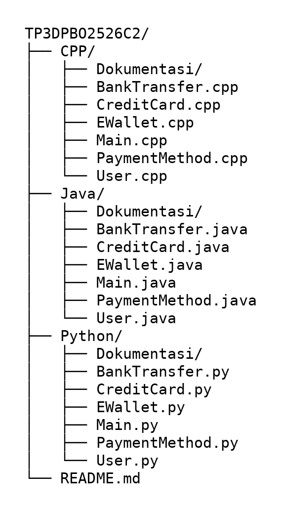
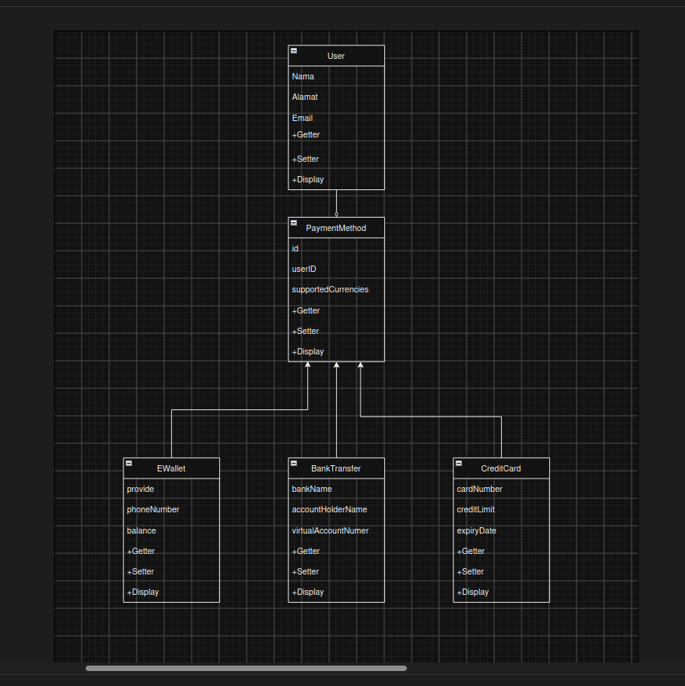

# TP3DPBO2526C2

# janji
Saya Renaldy Heryana dengan NIM 2509867 mengerjakan Tugas Praktikum 3 dalam mata kuliah Desain dan Pemrograman Berorientasi Objek untuk keberkahanNya maka saya tidak melakukan kecurangan seperti yang telah dispesifikasikan. Aamiin.

# STRUKTUR REPO

# DESIGN PROGRAM

# ALUR PROGRAM

1. Program dimulai dengan daftar user yang masih kosong.
2. Program menampilkan menu utama: Add user, Edit data, Show data, dan Exit program.
3. Input menu divalidasi. Jika bukan angka, program meminta input ulang.
4. User dapat menambahkan user baru dengan mengisi nama, alamat, dan email.
5. Setiap user otomatis memiliki satu CreditCard, satu EWallet, dan satu BankTransfer (composition) yang dibuat bersamaan dengan user.
6. User dapat mengedit data dengan memilih user dari daftar bernomor, lalu memilih jenis data (CreditCard, EWallet, atau BankTransfer) dan mengisi atributnya.
7. Jika jenis data yang dipilih sudah terisi, data lama ditimpa oleh data baru.
8. User dapat menampilkan data dengan memilih user, lalu memilih CreditCard, EWallet, BankTransfer, atau All data.
9. Pilihan All data menampilkan data user beserta ketiga metode pembayarannya.
10. Jika daftar user kosong atau nomor yang dipilih tidak valid, program menampilkan pesan dan kembali ke menu utama.
11. Program terus berulang sampai user memilih Exit program.

# ERROR HANDLING
Error handling saya buat untuk menangani masukan yang salah dari user. Pada masukan yang khusus angka, seperti pilihan menu, pilihan user, pilihan jenis data, credit limit, dan balance, jika user memasukkan selain angka maka program menampilkan pesan "enter only number" dan meminta masukan diulang sampai valid. Jika angka yang dimasukkan di luar pilihan yang tersedia, program menampilkan pesan "option invalid" dan kembali ke menu. Jika user memilih Edit data atau Show data saat belum ada user, program menampilkan pesan "No user yet." dan kembali ke menu utama.g.

# PENJELASAN ATRIBUT DAN METHOD

Disini adalah penjelasan berbagai atribut dan method dari code yang saya buat dari setiap class

## CLASS PaymentMethod

Penjelasan atribut dan method dari class PaymentMethod. Class ini adalah parent dari CreditCard, EWallet, dan BankTransfer.

### ATRIBUT

- id, adalah atribut yang saya buat sebagai kode unik dari metode pembayaran
- userID, adalah atribut yang mewakili kode pemilik dari metode pembayaran
- supportedCurrencies, adalah atribut yang mewakili daftar mata uang yang didukung oleh metode pembayaran

### METHOD

- getId dan setId, adalah method untuk mendapatkan (get) dan mengubah (set) nilai id dari kelas ini
- getUserId dan setUserId, adalah method untuk mendapatkan (get) dan mengubah (set) nilai userID dari kelas ini
- getSupportedCurrencies dan setSupportedCurrencies, adalah method untuk mendapatkan (get) dan mengubah (set) nilai supportedCurrencies dari kelas ini
- display, adalah method untuk menampilkan data umum metode pembayaran (id, userID, dan supportedCurrencies). Method ini dipanggil juga oleh class turunannya

## CLASS CreditCard

Penjelasan atribut dan method dari class CreditCard. Class ini turunan dari PaymentMethod.

### ATRIBUT

- cardNumber, adalah atribut untuk mewakili nomor kartu kredit
- creditLimit, adalah atribut untuk mewakili batas kredit dari kartu kredit
- expiryDate, adalah atribut untuk mewakili tanggal kedaluwarsa dari kartu kredit

### METHOD

- getCardNumber dan setCardNumber, adalah method untuk mendapatkan (get) dan mengubah (set) nilai cardNumber dari kelas ini
- getCreditLimit dan setCreditLimit, adalah method untuk mendapatkan (get) dan mengubah (set) nilai creditLimit dari kelas ini
- getExpiryDate dan setExpiryDate, adalah method untuk mendapatkan (get) dan mengubah (set) nilai expiryDate dari kelas ini
- display, adalah method untuk menampilkan data kartu kredit. Method ini menimpa (override) display milik PaymentMethod, memanggil display parent lebih dulu, lalu menampilkan cardNumber, creditLimit, dan expiryDate

## CLASS EWallet

Penjelasan atribut dan method dari class EWallet. Class ini turunan dari PaymentMethod.

### ATRIBUT

- provider, adalah atribut untuk mewakili penyedia layanan e-wallet
- phoneNumber, adalah atribut untuk mewakili nomor telepon yang terdaftar di e-wallet
- balance, adalah atribut untuk mewakili saldo yang ada di e-wallet

### METHOD

- getProvider dan setProvider, adalah method untuk mendapatkan (get) dan mengubah (set) nilai provider dari kelas ini
- getPhoneNumber dan setPhoneNumber, adalah method untuk mendapatkan (get) dan mengubah (set) nilai phoneNumber dari kelas ini
- getBalance dan setBalance, adalah method untuk mendapatkan (get) dan mengubah (set) nilai balance dari kelas ini
- display, adalah method untuk menampilkan data e-wallet. Method ini menimpa (override) display milik PaymentMethod, memanggil display parent lebih dulu, lalu menampilkan provider, phoneNumber, dan balance

## CLASS BankTransfer

Penjelasan atribut dan method dari class BankTransfer. Class ini turunan dari PaymentMethod.

### ATRIBUT

- bankName, adalah atribut untuk mewakili nama bank
- accountHolderName, adalah atribut untuk mewakili nama pemilik rekening
- virtualAccountNumber, adalah atribut untuk mewakili nomor virtual account

### METHOD

- getBankName dan setBankName, adalah method untuk mendapatkan (get) dan mengubah (set) nilai bankName dari kelas ini
- getAccountHolderName dan setAccountHolderName, adalah method untuk mendapatkan (get) dan mengubah (set) nilai accountHolderName dari kelas ini
- getVirtualAccountNumber dan setVirtualAccountNumber, adalah method untuk mendapatkan (get) dan mengubah (set) nilai virtualAccountNumber dari kelas ini
- display, adalah method untuk menampilkan data transfer bank. Method ini menimpa (override) display milik PaymentMethod, memanggil display parent lebih dulu, lalu menampilkan bankName, accountHolderName, dan virtualAccountNumber

## CLASS User

Penjelasan atribut dan method dari class User. Class ini memakai composition, yaitu membuat sendiri objek CreditCard, EWallet, dan BankTransfer di dalam konstruktornya.

### ATRIBUT

- name, adalah atribut untuk mewakili nama dari user
- address, adalah atribut untuk mewakili alamat dari user
- email, adalah atribut untuk mewakili email dari user
- creditCard, adalah atribut berupa objek CreditCard milik user, dibuat otomatis saat user dibuat
- eWallet, adalah atribut berupa objek EWallet milik user, dibuat otomatis saat user dibuat
- bankTransfer, adalah atribut berupa objek BankTransfer milik user, dibuat otomatis saat user dibuat

### METHOD

- getName dan setName, adalah method untuk mendapatkan (get) dan mengubah (set) nilai name dari kelas ini
- getAddress dan setAddress, adalah method untuk mendapatkan (get) dan mengubah (set) nilai address dari kelas ini
- getEmail dan setEmail, adalah method untuk mendapatkan (get) dan mengubah (set) nilai email dari kelas ini
- getCreditCard, getEWallet, dan getBankTransfer, adalah method untuk mendapatkan objek metode pembayaran milik user. Nilainya diubah lewat setter milik objek tersebut, misalnya getCreditCard().setCardNumber(...)
- display, adalah method untuk menampilkan data user (name, address, email), lalu menampilkan data CreditCard, EWallet, dan BankTransfer milik user tersebut

# PENJELASAN INHERITANCE DAN COMPOSITION

Disini adalah penjelasan penerapan inheritance dan composition pada program yang saya buat

## INHERITANCE

Inheritance saya terapkan pada class PaymentMethod dan turunannya. PaymentMethod saya jadikan class parent yang menyimpan atribut yang dimiliki semua metode pembayaran, yaitu id, userID, dan supportedCurrencies, lengkap dengan getter, setter, dan method display. CreditCard, EWallet, dan BankTransfer saya buat sebagai class child yang mewarisi PaymentMethod, sehingga ketiganya tidak perlu menulis ulang atribut tersebut. Setiap child hanya menambahkan atribut miliknya sendiri, yaitu cardNumber, creditLimit, dan expiryDate pada CreditCard, provider, phoneNumber, dan balance pada EWallet, serta bankName, accountHolderName, dan virtualAccountNumber pada BankTransfer.

Saat objek child dibuat, konstruktornya memanggil konstruktor PaymentMethod untuk mengisi id, userID, dan supportedCurrencies, baru kemudian mengisi atributnya sendiri. Method display juga memakai pewarisan: setiap child menimpa display milik PaymentMethod, memanggil display parent lebih dulu untuk menampilkan data umum, lalu menampilkan data miliknya sendiri.

## COMPOSITION

Composition saya terapkan pada class User. User memiliki tiga atribut berupa objek, yaitu creditCard, eWallet, dan bankTransfer. Ketiga objek itu dibuat oleh User sendiri di dalam konstruktornya, bukan dibuat di luar lalu dimasukkan, sehingga setiap user yang ditambahkan lewat menu Add user otomatis memiliki satu CreditCard, satu EWallet, dan satu BankTransfer miliknya sendiri. Karena itu data metode pembayaran milik satu user tidak tercampur dengan user lain, dan jika sebuah user dihapus dari daftar, ketiga objek miliknya ikut hilang.

Pada menu Edit data dan Show data, user dipilih terlebih dahulu, lalu data metode pembayarannya diakses lewat getter milik User, misalnya `user.getCreditCard().setCardNumber(...)`. Pilihan All data memanggil display milik User, yang menampilkan name, address, dan email, kemudian display milik CreditCard, EWallet, dan BankTransfer.

# DOKUMENTASI
## Java
Dokumentasi program java
### Sebelum tambah user

### Sesudah tambah user sebelum tambah data

### Sesudah tambah data

## Python
Dokumentasi program Python
### Sebelum tambah user

### Sesudah tambah user sebelum tambah data

### Sesudah tambah data

## C++
Dokumentasi program C++
### Sebelum tambah user

### Sesudah tambah user sebelum tambah data

### Sesudah tambah data

